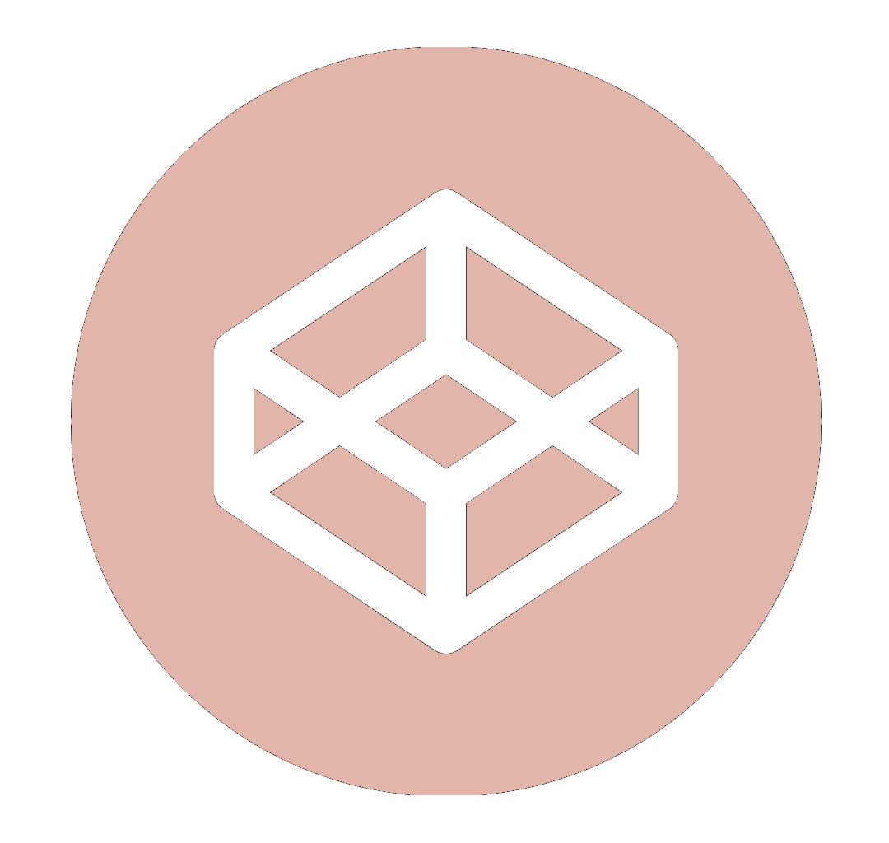

### Hi, Im Edgar 👋

<!-- cover -->

<!-- Me .GIF -->
 
 
 <!-- About me -->
 

 🔭 I’m currently studying computer science.   
 🌱 I’m currently learning everything related to web development.   
 🤔 I’m looking for help with.  
 ⚡ Fun fact: I love cats and the piano.    
 
  .::I recommend you to view my profile in dark mode::. 

          

<!-- Inspiration -->
                                                1|
                                                2|     cout<<"Anything is possible"<<endl;
                                                3|

<!-- DarkMode SnakeGame -->

<picture>
  <source media="(prefers-color-scheme: dark)" srcset="github-snake-dark.svg" />
  <source media="(prefers-color-scheme: light)" srcset="github-snake.svg" />
  
</picture>

<!-- Snake Game -->

  
  <a href="https://github.com/EdgarAnt">
  
  
    
  

 
 <h3 align="center">Certifications</h3>
 
 <!-- Certifactes -->
 
~AZ-900 Microsoft Azure Fundamentals(ID: P37u-uSe3) by Mmicrosoft

<!-- My portfolio -->

  
   
  <a href="https://edgarant.github.io/">
  ~°my Portfolio°~    

<!-- Icons -->

  <!-- Icono CodePen -->
    
  
  <!-- Icono Linkedin -->
  

  <!-- Icono Instagram -->
  

 

